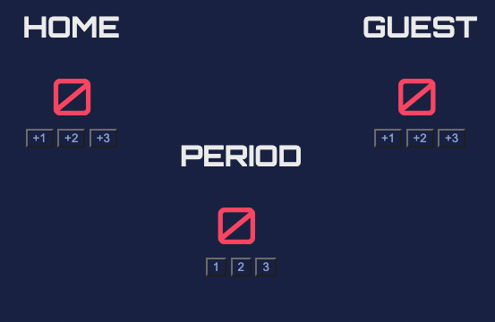
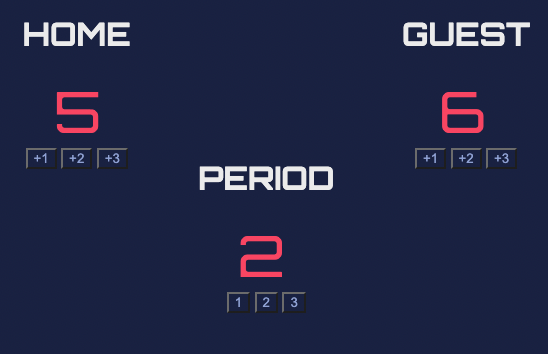

# Frescobol Scoreboard 

This project was made for educational purposes but could be applied as a simple component of a game. It was made by following a figma design, although I took a little creative license in changing the font to Orbitron to make it look more like an authentic scoreboard - like the ones you see at basketball games or other major sporting events. 

As mentioned on my website portfolio, this summer, I got into playing Frescobol.

I remember watching cousins playing it on the beach in Greece. We would always pool all of our games together and find ways to play inclusively.

Seeing as we had one pair of raquets and we were a group of four or more cousins, having a scoreboard such as this app would have been helpful during the competitive moments allowing for equitable play.

Some rules that could be used: one person or more can act as a referee or judge of sorts keeping track of the score, etc. Players score a point when their opponent misses a fair comeback. For example, if player A hits the ball back to their opponent in style, player A scores two points or if player B effectively hits a rather difficult comeback, player B scores three points. Play best out of 3 periods. Each period lasts until the ball hits the ground.

## How the app works: 
The app keeps track of the score for home and guest teams or opponents and is not limited to the use of tracking Frescocol games. 

## This is what the landing page looks like

## Click on the +1, +2, +3 buttons under HOME or GUEST depending on the number of points earned and click on 1, 2, or 3 under PERIOD to indicate which period it is. 

Once a period is complete, simply refresh the browser to reset the scoreboard.

Have fun!

## Special thanks to: 

Per Herald Borgen at Scrimba
